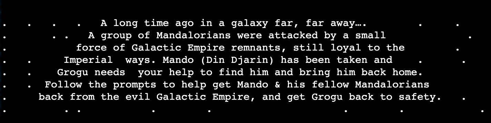
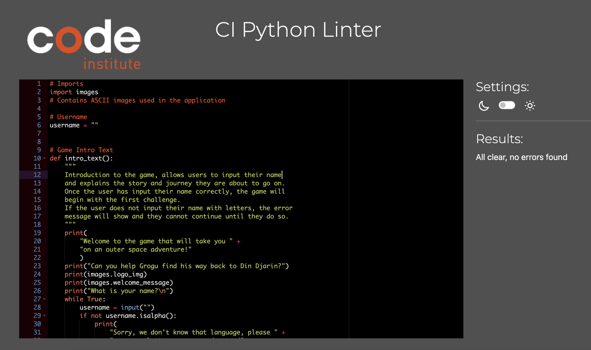

# [Help Grogu](https://help-grogu-5d7736926f92.herokuapp.com/ "take you to help grogu program")

Help Grogu is a text based game that will bring you on an adventure to help Grogu find his way back to Mando. 
Choose out of the options to try to try make your way through the game.

# Table of Contents

- [Help Grogu](#help-grogu)
- [Table of Contents](#table-of-contents)
- [Key Project Goals](#key-project-goals)
  - [Target Audience](#target-audience)
  - [User Stories](#user-stories)
  - [Flow Chart](#flow-chart)
- [Features](#features)
- [Testing](#testing)
  - [Manual Testing](#manual-testing)
      - [Laptops](#laptops)
      - [Desktop](#desktop)
      - [Browsers](#browsers)
  - [Validator Testing](#validator-testing)
    - [Errors that were found in validator and fixed](#errors-that-were-found-in-validator-and-fixed)
  - [Unfixed Bugs](#unfixed-bugs)
- [Deployment](#deployment)
  - [Deploying on GitHub Pages](#deploying-on-github-pages)
- [Technologies Used](#technologies-used)
- [Future Features to Implement](#future-features-to-implement)
- [Credits](#credits)
  - [Content](#content)
    - [Images](#images)
- [Education](#education)
  - [Game Inspiration](#game-inspiration)

# Key Project Goals

Project Goals

- Build a game using Python that lets you try to choose your own adventure, with 1 right answer one 2 wrong ones. 
- Create a user friendly experience that makes the user feel like they are in the star wars universe.
- Create a game that is easy to understand.
- Ensure user cannot choose an input other than the ones that the game has given to choose from.

## Target Audience

The target audience for this website is for any and all star wars fans (but not limited to) who want to have a fun time with this choose your own adventure game. 

## User Stories

### First Time Visitor

1. As a first time visitor I want to easily understand the purpose of the game
2. As a first time visitor I want to have fun playing the game
3. As a first time visitor I want to feel like I can come back and play again!

### Returning Visitor

1. As a returning user I want to get further in the game than I did on my last go
2. As a returning user I want to see different outcomes depending on the option I choose
3. As a returning user I want to see new questions added so the game continues 

[Back to Top](#help-grogu)

# Features

## Background Image

The background image helps to add to the user experience while making their way through the game. 

## ASCII Images

ASCII images were used to help bring users into the star wars universe. 
All images were taken from 

The star wars logo was used - this was taken from [STAR WARS](https://ascii.co.uk/art/starwars "link to star wars ascii")

The star wars intro text was used - this was taken and then adapted from [STAR WARS](https://ascii.co.uk/art/starwars "link to star wars ascii")

Grogu image was also used - this was taken from

[Back to Top](#help-grogu)

# Testing

## Manual Testing

Manual testing was carried out on every page and with every link.

#### Laptops

- Macbook Air

#### Desktop

- iMac

#### Browsers

- Google Chrome
- Safari
- Firefox

## Validator Testing

### Errors that were found in validator and fixed

Some errors that were found and fixed included
- Trailing whitespace
- Line too long

[Back to Top](#help-grogu)

## Run Game Testing Comments

| **TEST**                  | **ACTION**        | **EXPECTATION**                                            | **RESULT**        | **FIX** |
| ------------------------- | ----------------- | ---------------------------------------------------------- | ----------------- | ------- |
| Run Program Button | Click run program button | Game begins | Works as expected | N/A     |

## What is your name testing comments

| **TEST**          | **ACTION**                    | **EXPECTATION**                           | **RESULT**         | **FIX** |
| ----------------- | ----------------------------- | ----------------------------------------- | ------------------ | ------- |
| What is your name | Typed letters to spell name | Name accepted and game continues | Worked as expected | N/A |
| What is your name | Typed numbers as name | Error message should appear "Sorry, we don't know that language, pleaseuse some letters we can understand" | Worked as expected | N/A |
| What is your name | Pressed Enter for name | Error message should appear "Sorry, we don't know that language, pleaseuse some letters we can understand" | Worked as expected | N/A |

## First Challenge testing comments

| **TEST**          | **ACTION**                    | **EXPECTATION**                           | **RESULT**         | **FIX** |
| ----------------- | ----------------------------- | ----------------------------------------- | ------------------ | ------- |
| Option A - Try to win a ship in a card game with sketchy gamblers at the local drinking spot? | Pressed A | Message should show "You lose the game and now owe all the gamblers a drink!" and the endgame() is started | Message was shown and endgame() ran | N/A |
| Option B - Try to sneak onboard a ship leaving the shipyard as stowaways? | Pressed B | Message should show "You get found and chucked off the ship!" and the endgame() is started | Message was shown and endgame() ran | N/A |
| Option C - Get Grogu to steal someone's keys using the force | Pressed C | Message should show "Grogu gets the keys and you find the ship, time to get going!" and second_challenge() begins | Message was shown and second_challenge began | N/A |
| Choose any other letter | Pressed D| Message "You must choice A, B or C" should appear and user must choose again | Worked as expected | N/A |
| Choose lowercase a, b or c | Pressed c | Message should show "Grogu gets the keys and you find the ship, time to get going!" and second_challenge() begins | Worked as expected | N/A |
| Enter | Pressed enter | Message "You must choice A, B or C" should appear and user must choose again | Worked as expected | N/A |

## Second Challenge testing comments

| **TEST**          | **ACTION**                    | **EXPECTATION**                           | **RESULT**         | **FIX** |
| ----------------- | ----------------------------- | ----------------------------------------- | ------------------ | ------- |
|  |  |  | Worked as expected | N/A |
|  |  |  | Worked as expected | N/A |
|  |  |  | Worked as expected | N/A |
|  |  |  | Worked as expected | N/A |
|  |  |  | Worked as expected | N/A |
|  |  |  | Worked as expected | N/A |

## Third Challenge testing comments

| **TEST**          | **ACTION**                    | **EXPECTATION**                           | **RESULT**         | **FIX** |
| ----------------- | ----------------------------- | ----------------------------------------- | ------------------ | ------- |
|  |  |  | Worked as expected | N/A |
|  |  |  | Worked as expected | N/A |
|  |  |  | Worked as expected | N/A |
|  |  |  | Worked as expected | N/A |
|  |  |  | Worked as expected | N/A |
|  |  |  | Worked as expected | N/A |

## Fourth Challenge testing comments

| **TEST**          | **ACTION**                    | **EXPECTATION**                           | **RESULT**         | **FIX** |
| ----------------- | ----------------------------- | ----------------------------------------- | ------------------ | ------- |
|  |  |  | Worked as expected | N/A |
|  |  |  | Worked as expected | N/A |
|  |  |  | Worked as expected | N/A |
|  |  |  | Worked as expected | N/A |
|  |  |  | Worked as expected | N/A |
|  |  |  | Worked as expected | N/A |

## Sixth Challenge testing comments

| **TEST**          | **ACTION**                    | **EXPECTATION**                           | **RESULT**         | **FIX** |
| ----------------- | ----------------------------- | ----------------------------------------- | ------------------ | ------- |
|  |  |  | Worked as expected | N/A |
|  |  |  | Worked as expected | N/A |
|  |  |  | Worked as expected | N/A |
|  |  |  | Worked as expected | N/A |
|  |  |  | Worked as expected | N/A |
|  |  |  | Worked as expected | N/A |

## End Game testing comments

| **TEST**          | **ACTION**                    | **EXPECTATION**                           | **RESULT**         | **FIX** |
| ----------------- | ----------------------------- | ----------------------------------------- | ------------------ | ------- |
|  |  |  | Worked as expected | N/A |
|  |  |  | Worked as expected | N/A |
|  |  |  | Worked as expected | N/A |
|  |  |  | Worked as expected | N/A |
|  |  |  | Worked as expected | N/A |
|  |  |  | Worked as expected | N/A |

## Win Game testing comments

| **TEST**          | **ACTION**                    | **EXPECTATION**                           | **RESULT**         | **FIX** |
| ----------------- | ----------------------------- | ----------------------------------------- | ------------------ | ------- |
|  |  |  | Worked as expected | N/A |
|  |  |  | Worked as expected | N/A |
|  |  |  | Worked as expected | N/A |
|  |  |  | Worked as expected | N/A |
|  |  |  | Worked as expected | N/A |
|  |  |  | Worked as expected | N/A |

## Unfixed Bugs

No bugs were let to fix. 

[Back to Top](#help-grogu)

# Deployment

This project was developed using [Codeanywhere](https://app.codeanywhere.com/ "Link to Codeanywhere login"), which was then committed and pushed to GitHub using the Codeanywehere terminals.

## Deploying on GitHub Pages

To deploy this page to Heroku from its Codeanywhere repository, the following steps were taken:

1. Get Python Essentials Template from Code Institute [P3 Template](https://github.com/Code-Institute-Org/p3-template "p3 template link")
2. Create new repository using the P3 template 
3. Copy github code link and paste into code anywhere to create new workspace.  
1. Log into [Heroku]( https://id.heroku.com/login "Link to Heroku login page") 
2. Create new app
3. 
The live link can be found here [Help Grogu](https://help-grogu-5d7736926f92.herokuapp.com/ "Link to deployed Help Grogu page")

# Technologies Used

- [Python]( https://en.wikipedia.org/wiki/Python_(programming_language) "link to Python wikipedia")
- [Google Fonts](https://fonts.google.com/ "Link to Google Fonts webpage")
- [Codeanywhere](https://app.codeanywhere.com/ "Link to Codeanywhere webpage")
  GitPod was used for writing code, adding, committing and pushing to github
- [GitHub](https://github.com/ "Link to GitHub webpage")
  GitHub was used to store the code files, README files and asset files after pushing
- [Canva](https://www.canva.com/en_gb/login/ "Link to Canva webpage")
  Canva Pro was used to create images for the site
- [Am I Responsive?](https://ui.dev/amiresponsive "Link to Am I responsive webpage")
  Am I Responsive was used in order to see responsive design and create screenshots of the final page on different devices.

[Back to Top](#help-grogu)

# Future Features to Implement

# Credits

## Content

Wording for the site was all created by Sarah Goodwin

### Images

Background image for the site were all created by Sarah Goodwin using Canva Pro

# Education

The following sites assisted in learning more about the code that was being written, to gain a better understanding of how to best write the code and to get inspiration for the game.

- [Stack Overflow](https://stackoverflow.com/ "Link to Stack Overflow webpage")
  Stack overflow was used to answer questions as to why certain code may not be performing as expected.
- [W3Schools](https://www.w3schools.com/ "Link to W3Schools webpage")
  W3Schools was used to gain a better understanding of css styles and how to apply them
- [ChatGPT](https://openai.com/blog/chatgpt "link to chatgpt page")
  ChatGPT was used gain a better understanding of python functions

- [CluelessBiker/mentoring](https://github.com/CluelessBiker/mentoring "link to CluesslessBiker repo")
  CluelessBiker mentoring github page was used to check examples of projects, access links to resources such as validators and w3schools, Am I Responsive.

- Comparative Programming Languages Essentials & Python Essentials Code Insititue Modules
  The modules notes that Sarah Goodwin took for the Comparative Programming & Python Essentials sections were referred back to write code

## Game Inspiration

[Back to Top](#help-grogu)

