# [Help Grogu](https://help-grogu-5d7736926f92.herokuapp.com/ "take you to help grogu program")

Help Grogu is a text-based game that will bring you on an adventure to help Grogu find his way back to Mando. 
Choose out of the options to try to make your way through the game.

# Table of Contents

- [Help Grogu](#help-grogu)
- [Table of Contents](#table-of-contents)
- [Key Project Goals](#key-project-goals)
  - [Target Audience](#target-audience)
  - [User Stories](#user-stories)
- [Design](#design)
- [Features](#features)
- [Testing](#testing)
  - [Manual Testing](#manual-testing)
      - [Laptops](#laptops)
      - [Desktop](#desktop)
      - [Browsers](#browsers)
  - [Testing](#validator-testing)
    - [Errors that were found in validator and fixed](#errors-that-were-found-in-validator-and-fixed)
  - [Unfixed Bugs](#unfixed-bugs)
- [Deployment](#deployment)
- [Technologies Used](#technologies-used)
- [Future Features to Implement](#future-features-to-implement)
- [Credits](#credits)
- [Education](#education)

# Key Project Goals

Project Goals

- Build a game using Python that lets you try to choose your own adventure, with 1 right answer one 2 wrong ones. 
- Create a user-friendly experience that makes the user feel like they are in the Star Wars universe.
- Create a game that is easy to understand.
- Ensure the user cannot choose an input other than the ones that the game has given to choose from.

## Target Audience

The target audience for this website is for any and all Star Wars fans (but not limited to) who want to have a fun time with this choose-your-own-adventure game. 

## User Stories

### First Time Visitor

1. As a first-time visitor I want to easily understand the purpose of the game
2. As a first-time visitor I want to have fun playing the game
3. As a first-time visitor I want to feel like I can come back and play again!

### Returning Visitor

1. As a returning user I want to get further in the game than I did on my last go
2. As a returning user I want to see different outcomes depending on the option I choose
3. As a returning user I want to see new questions added so the game continues 

[Back to Top](#help-grogu)

# Design

WireFrame

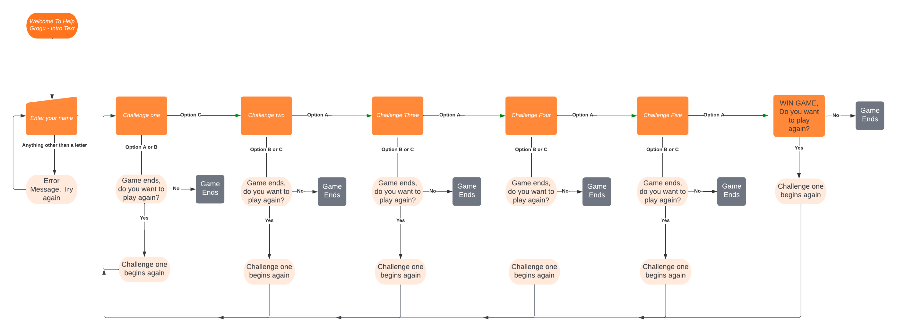

# Features

## Background Image

The background image helps to add to the user experience while making their way through the game. 

## ASCII Images

ASCII images were used to help bring users into the Star Wars universe. 
All images were taken from 

The Star Wars logo was used - this was taken from [STAR WARS](https://ascii.co.uk/art/starwars "link to star wars ascii")

The Star Wars intro text was used - this was taken and then adapted from [STAR WARS](https://ascii.co.uk/art/starwars "link to star wars ascii")

Grogu image was also used - this was taken from [emoji combos](https://emojicombos.com/grogu-ascii-art "link to emoji combos")

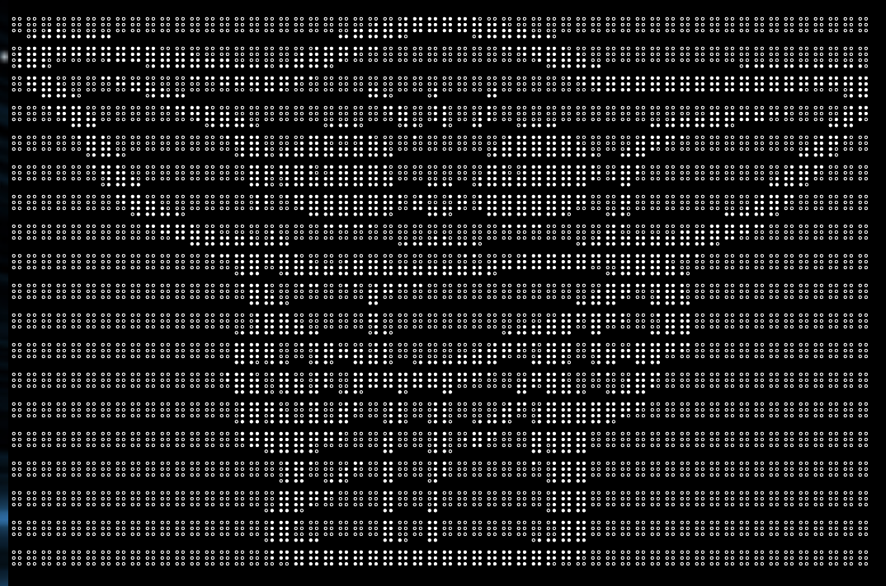

[Back to Top](#help-grogu)

## Game Play

### Intro Text

What is your name
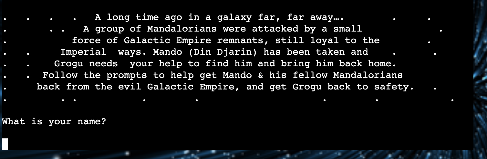

### First Challenge

First Challenge Options
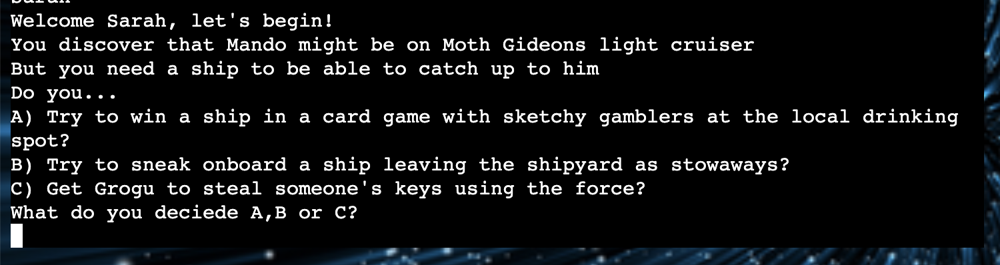

### Second Challenge

Second Challenge Options
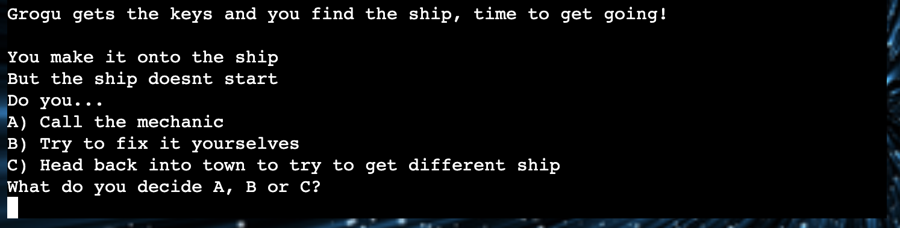

### Third Challenge

Third Challenge Options
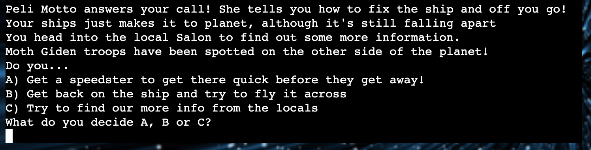

### Fourth Challenge

Fourth Challenge Options
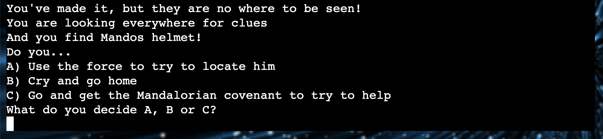

### Fifth Challenge

Fifth Challenge Options
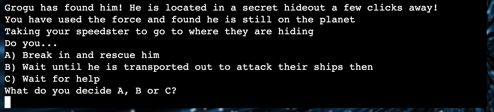

### End Game

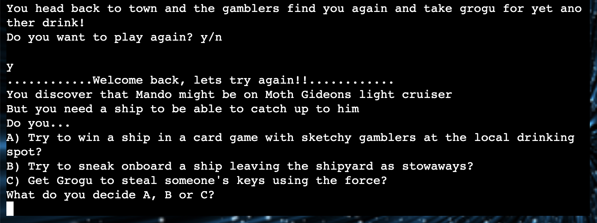

### Win Game

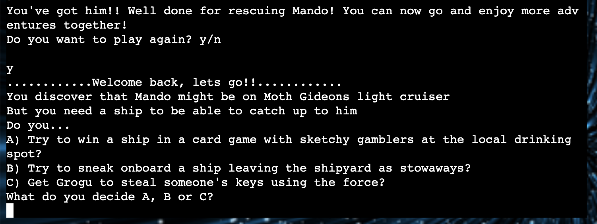

### Error handling

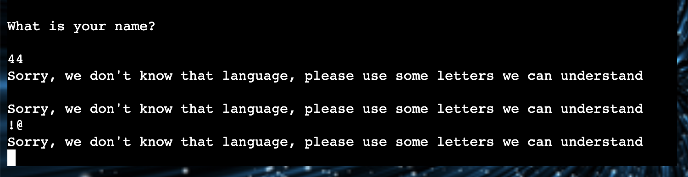

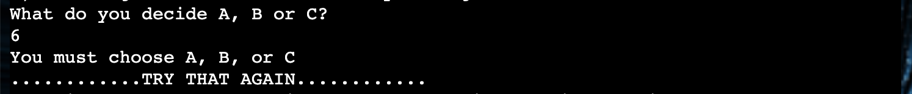

# Testing

## Manual Testing

Manual testing was carried out on every option.

#### Laptops

- MacBook Air

#### Desktop

- iMac

#### Browsers

- Google Chrome
- Safari
- Firefox

## Validator Testing

### Errors that were found in the validator and fixed

Some errors that were found and fixed included
- Trailing whitespace
- Line too long

[Back to Top](#help-grogu)

## Run Game Testing Comments

| **TEST**                  | **ACTION**        | **EXPECTATION**                                            | **RESULT**        | **FIX** |
| ------------------------- | ----------------- | ---------------------------------------------------------- | ----------------- | ------- |
| Run Program Button | Click run program button | Game begins | Works as expected | N/A |

## What is your name testing comments

| **TEST**          | **ACTION**                    | **EXPECTATION**                           | **RESULT**         | **FIX** |
| ----------------- | ----------------------------- | ----------------------------------------- | ------------------ | ------- |
| What is your name | Typed letters to spell name | Name accepted and game continues | Worked as expected | N/A |
| What is your name | Typed numbers as name | Error message should appear "Sorry, we don't know that language, please use some letters we can understand" | Worked as expected | N/A |
| What is your name | Pressed Enter for name | Error message should appear "Sorry, we don't know that language, please use some letters we can understand" | Worked as expected | N/A |

## First Challenge testing comments

| **TEST**          | **ACTION**                    | **EXPECTATION**                           | **RESULT**         | **FIX** |
| ----------------- | ----------------------------- | ----------------------------------------- | ------------------ | ------- |
| Option A | Pressed A | Message should show "You lose the game and now owe all the gamblers a drink!" and the endgame() is started | Message was shown and endgame() ran | N/A |
| Option B | Pressed B | Message should show "You get found and chucked off the ship!" and the endgame() is started | Message was shown and endgame() ran | N/A |
| Option C | Pressed C | Message should show "Grogu gets the keys and you find the ship, time to get going!" and second_challenge() begins | Message was shown and second_challenge began | N/A |
| Choose any other letter | Pressed D| Message "You must choose A, B or C" should appear and the user must choose again | Worked as expected | N/A |
| Choose lowercase a, b or c | Pressed c | Message should show "Grogu gets the keys and you find the ship, time to get going!" and second_challenge() begins | Worked as expected | N/A |
| Enter | Pressed enter | Message "You must choose A, B or C" should appear and the user must choose again | Worked as expected | N/A |

## Second Challenge testing comments

| **TEST**          | **ACTION**                    | **EXPECTATION**                           | **RESULT**         | **FIX** |
| ----------------- | ----------------------------- | ----------------------------------------- | ------------------ | ------- |
| Option A | Pressed A | Message should show "Peli Motto answers your call! She tells you how to fix the ship and off you go!" and the third_challenge() function should run | Message was shown and third_challenge() ran | Worked as expected | N/A |
| Option B | Pressed B | Message should show "Grogu drops the spanner down a shoot and you can't fix the ship" and the end_game() function should run | Message was shown and end_game() ran | Worked as expected | N/A |
| Option C | Pressed C | Message should show "You head back to town and the gamblers find you again and take grogu for yet another drink!" and the end_game() function should run | Message was shown and end_game() ran | Worked as expected | N/A |
| Choose any other letter | Pressed F | Message "You must choose A, B or C" should appear and the user must choose again | Worked as expected | N/A |
| Choose lowercase a, b or c | Pressed b | Message should show "Grogu drops the spanner down a shoot and you can't fix the ship" and the end_game() function should run | Message was shown and end_game() ran | Worked as expected | N/A |
| Another key | Pressed ! | Message "You must choose A, B or C" should appear and the user must choose again | Worked as expected | N/A |

## Third Challenge testing comments

| **TEST**          | **ACTION**                    | **EXPECTATION**                           | **RESULT**         | **FIX** |
| ----------------- | ----------------------------- | ----------------------------------------- | ------------------ | ------- |
| Option A | Pressed A | Message should show "You've made it, but they are nowhere to be seen!" and the fourth_challenge() function should run | Message was shown and fourth_challenge() ran | Worked as expected | N/A |
| Option B | Pressed B | Message should show "AND CRASH. Sorry your ship is broken and it will be a while before you can get it going again" and the end_game() function should run | Message was shown and end_game() ran | Worked as expected | N/A |
| Option C | Pressed C | Message should show "Grogu has been distracted by a local's eggs..." and the end_game() function should run | Message was shown and end_game() ran | Worked as expected | N/A |
| Choose any other letter | Pressed h | Message "You must choose A, B or C" should appear and the user must choose again | Worked as expected | N/A |
| Choose lowercase a, b or c | Pressed b | Message should show "AND CRASH. Sorry your ship is broken and it will be a while before you can get it going again" and the end_game() function should run | Message was shown and end_game() ran | Worked as expected | N/A |
| Another key | Pressed 5 | Message "You must choose A, B or C" should appear and the user must choose again | Worked as expected | N/A |

## Fourth Challenge testing comments

| **TEST**          | **ACTION**                    | **EXPECTATION**                           | **RESULT**         | **FIX** |
| ----------------- | ----------------------------- | ----------------------------------------- | ------------------ | ------- |
| Option A | Pressed A | Message should show "Grogu has found him! He is located in a secret hideout a few clicks away!" and the fifth_challenge() function should run | Message was shown and fifth_challenge() ran | Worked as expected | N/A |
| Option B | Pressed B | Message should show "You go home and Mando is lost forever" and the end_game() function should run | Message was shown and end_game() ran | Worked as expected | N/A |
| Option C | Pressed C | Message should show "You get back to your ship to contact the covenant, but who knows when they'll get here!" and the end_game() function should run | Message was shown and end_game() ran | Worked as expected | N/A |
| Choose any other letter | Pressed i | Message "You must choose A, B or C" should appear and the user must choose again | Worked as expected | N/A |
| Choose lowercase a, b or c | Pressed a | Message should show "Grogu has found him! He is located in a secret hideout a few clicks away!" and the end_game() function should run | Message was shown and end_game() ran | Worked as expected | N/A |
| Another key | Pressed spacebar | Message "You must choose A, B or C" should appear and the user must choose again | Worked as expected | N/A |

## Fifth Challenge testing comments

| **TEST**          | **ACTION**                    | **EXPECTATION**                           | **RESULT**         | **FIX** |
| ----------------- | ----------------------------- | ----------------------------------------- | ------------------ | ------- |
| Option A | Pressed A | Message should show "You've got him!! Well done for rescuing Mando! You can now go and enjoy more adventures together!" and the win_game() function should run | Message was shown and win_game() ran | Worked as expected | N/A |
| Option B | Pressed B | Message should show "You wait, and wait and they don't come back, you decide to go get help and miss their ship departing..." and the end_game() function should run | Message was shown and end_game() ran | Worked as expected | N/A |
| Option C | Pressed C | Message should show "Looks like no one is coming and Moth Giden got away!" and the end_game() function should run | Message was shown and end_game() ran | Worked as expected | N/A |
| Choose any other letter | Pressed Q | Message "You must choose A, B or C" should appear and the user must choose again | Worked as expected | N/A |
| Choose lowercase a, b or c | Pressed c | Message should show "Looks like no one is coming and Moth Giden got away!" and the end_game() function should run | Message was shown and end_game() ran | Worked as expected | N/A |
| Another key | Pressed enter | Message "You must choose A, B or C" should appear and the user must choose again | Worked as expected | N/A |

## End Game testing comments

| **TEST**          | **ACTION**                    | **EXPECTATION**                           | **RESULT**         | **FIX** |
| ----------------- | ----------------------------- | ----------------------------------------- | ------------------ | ------- |
| Choose Y | Press Y | Game restarts at the first challenge without intro text and with the message "............Welcome back, let's try again!!............" | Worked as expected | N/A |
| Choose N | Press N | The Game quits and the message "Thanks for helping Grogu try to get Mando back! Better luck next time!" should show | Worked as expected | N/A |
| Choose lowercase y or n | Pressed n | Game quits and the message "Thanks for helping Grogu rescue his best pal!!" should show | Worked as expected | N/A |
| Any other letter | Pressed U | Message "You must choose yes or no" should show and the user must try again | Worked as expected | N/A |
| Another key | Pressed 7 | Message "You must choose yes or no" should show and the user must try again | Worked as expected | N/A |

## Win Game testing comments

| **TEST**          | **ACTION**                    | **EXPECTATION**                           | **RESULT**         | **FIX** |
| ----------------- | ----------------------------- | ----------------------------------------- | ------------------ | ------- |
| Choose Y | Press Y | Game restarts at first challenge without intro text and with the message "............Welcome back, let's go!!............" | Worked as expected | N/A |
| Choose N | Press N | The Game quits and the message "Thanks for helping Grogu rescue his best pal!!" should show | Worked as expected | N/A |
| Choose lowercase y or n | Pressed y | Game quits and the message "Thanks for helping Grogu rescue his best pal!!" should show | Worked as expected | N/A |
| Any other letter | Pressed U | Message "You must choose yes or no" should show and the user must try again | Worked as expected | N/A |
| Another key | Pressed % | Message "You must choose yes or no" should show and the user must try again | Worked as expected | N/A |

## Unfixed Bugs

No bugs were left to fix. 

[Back to Top](#help-grogu)

# Deployment

This project was developed using [Codeanywhere](https://app.codeanywhere.com/ "Link to Codeanywhere login"), which was then committed and pushed to GitHub using the Codeanywehere terminals.

## Deploying on GitHub Pages

To deploy this page to Heroku from its Codeanywhere repository, the following steps were taken:

1. Get Python Essentials Template from Code Institute [P3 Template](https://github.com/Code-Institute-Org/p3-template "p3 template link")
2. Create a new repository using the P3 template 
3. Copy the repo URL and copy it into Codeanywhere to create a new workspace
4. Close the README tab and create the first file named index.html
5. Open the terminal, type (git add .) (git commit -m "initial commit") (git push)
6. Type 'Pip3 freeze > requirements.txt' into the terminal and commit. 
7. Log into [Heroku]( https://id.heroku.com/login "Link to Heroku login page") 
8. Create a new app and name it Help Grogu
9. Add config vars - The key is PORT and the value is 8000
10. Add build pack, select Python - click save, then select node.js - click save - in that order
11. Go to the deploy section - select automatic deploys
12. The project is now deployed. 
The live link can be found here [Help Grogu](https://help-grogu-5d7736926f92.herokuapp.com/ "Link to deployed Help Grogu page")

# Technologies Used

- [Python]( https://en.wikipedia.org/wiki/Python_(programming_language) "link to Python wikipedia")
- [Codeanywhere](https://app.codeanywhere.com/ "Link to Codeanywhere webpage")
  Codeanywhere was used for writing code, adding, committing and pushing to GitHub
- [GitHub](https://github.com/ "Link to GitHub webpage")
  GitHub was used to store the code files, README files and asset files after pushing
- [Heroku](https://id.heroku.com/login "Link to Heroku login")
  Heroku was used to deploy the project. 
- [Canva](https://www.canva.com/en_gb/login/ "Link to Canva webpage")
  Canva Pro was used to create the background image for the site
- [Am I Responsive?](https://ui.dev/amiresponsive "Link to Am I responsive webpage")
  Am I Responsive was used to see the responsive design and create screenshots of the final page on different devices.

[Back to Top](#help-grogu)

# Future Features to Implement

- Add more challenges and options for users to continue the game.
- Have more 'choose your own adventure' options where each choice takes the game somewhere different, rather than ending the game after only 1 wrong choice. 
- Add more creative images to the game to enhance user experience.
- Add a slow print to the game to make reading the text easier for the user. 

# Credits

- Learnt how to add ASCII images from [Stack Overflow](https://stackoverflow.com/questions/23623288/print-full-ascii-art "link to stack overflow")

## Content

Wording for the site was all created by Sarah Goodwin

### Images

Background images for the site were all created by Sarah Goodwin using Canva Pro

# Education

The following sites assisted in learning more about the code that was being written, to gain a better understanding of how to best write the code and to get inspiration for the game.

- [Stack Overflow](https://stackoverflow.com/ "Link to Stack Overflow webpage")
  Stack overflow was used to answer questions as to why certain code may not be performing as expected.
- [W3Schools](https://www.w3schools.com/ "Link to W3Schools webpage")
  W3Schools was used to gain a better understanding of CSS styles and how to apply them
- [ChatGPT](https://openai.com/blog/chatgpt "link to chatbot page")
  ChatGPT was used to gain a better understanding of Python functions
- [CluelessBiker/mentoring](https://github.com/CluelessBiker/mentoring "link to CluesslessBiker repo")
  CluelessBiker mentoring GitHub page was used to check examples of projects, and access links to resources such as validators and w3schools, Am I Responsive.
- [Love Sandwiches](https://github.com/sarahgoodwin93/love-sandwiches "link to love sandwiches")
  Love Sandwiches was used as part of the education process and was referred back to for the deployment of the project
- Comparative Programming Languages Essentials & Python Essentials Code Institute Modules
  The module notes that Sarah Goodwin took for the Comparative Programming & Python Essentials sections was referred back to writing code

[Back to Top](#help-grogu)